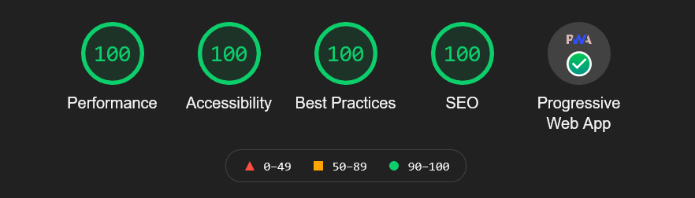

## Gatsby

블로그를 직접 만들어 보고 싶어 [Gatsby](https://www.gatsbyjs.com/)를 선택했다. React 기반의 대표적인 Static Site Generator로 다양한 플러그인을 제공하고 커뮤니티가 풍부하다. 덕분에 빠르게 커스터마이징해 블로그를 만들 수 있었다.

### gatsby-starter-blog

Gatsby에서는 다양한 스타터를 제공하는데 최대한 가볍게 시작하기 위해 공식 블로그 스타터인 [gatsby-starter-blog](https://www.gatsbyjs.com/starters/gatsbyjs/gatsby-starter-blog)를 선택했다.


### Netlify

[Netlify](https://www.netlify.com/)는 정적 사이트를 호스팅해주는 서비스로 프론트엔드 스택으로만 구성된 사이트가 필요한 많은 사람들이 이용하는 것 같다. 사용법이 정말 간단한데 몇 번의 클릭만으로 사이트를 배포할 수 있다. 이 블로그의 경우 Github 계정과 연동하여 push할 때마다 자동으로 빌드 및 배포되도록 했다.

## Customizing

커스터마이징은 최소화하고 글 쓰는 데 집중하고 싶다. 블로그에 글이 좀 쌓이면 차차 다른 기능을 추가해보려 한다.

### 한글 폰트

[gatsby-plugin-webfonts](https://www.gatsbyjs.com/plugins/gatsby-plugin-webfonts/) 플러그인을 사용해 구글 폰트를 적용했다. 기본 폰트는 Noto Sans KR, 소스 코드 폰트는 Fira Code를 사용했다.

```js
// gatsby-config.js

{
  resolve: `gatsby-plugin-webfonts`,
  options: {
    fonts: {
      google: [
        {
          family: "Noto Serif KR",
          variants: ["400", "700"],
        },
        {
          family: "Noto Sans KR",
          variants: ["400", "700"],
        },
        {
          family: "Fira Code",
          variants: ["400"],
        },
      ],
    },
  },
}
```

### Code Hightlight

[prism-themes](https://github.com/PrismJS/prism-themes) 테마 중 prism-material-dark 테마를 적용했다.

```js
// gatsby-browser.js

// Highlighting for code blocks
import "prism-themes/themes/prism-material-dark.css"
```

### 태그

Gatsby는 문서화가 정말 잘 되어 있는데, [이 글](https://www.gatsbyjs.com/docs/adding-tags-and-categories-to-blog-posts/)을 참고해서 전체 태그를 볼 수 있는 page와 각 태그별 포스트 목록을 보여주는 template을 만들었다.

### 검색: Flex Search

[검색 기능을 추가하는 방법](https://www.gatsbyjs.com/docs/how-to/adding-common-features/adding-search/)도 마찬가지로 잘 문서화되어 있다.
API based 보다는 Client-side 검색 기능을 추가하고 싶어 [gatsby-plugin-local-search](https://www.gatsbyjs.com/plugins/gatsby-plugin-local-search) 플러그인의 Flex Search를 선택했다. 분명 README에는 한글도 지원된다고 나와 있으나 막상 따라해보면 한글, 영어 모두 검색되지 않았고 반쯤 포기하려던 차에...

오랜 구글링 끝에 [해결방법](https://github.com/nextapps-de/flexsearch/issues/202#issue-752860900)을 찾을 수 있었다. 이후에 더 좋은 토크나이저로 바꾸거나 다른 search 라이브러리로 변경할지도 모르겠지만 우선은 만족.

```js
{
  resolve: "gatsby-plugin-local-search",
  options: {
    name: "pages",
    engine: "flexsearch",
    engineOptions: {
      encode: "icase",
      tokenize: function (str) {
        const cjkItems = str.replace(/[\0-\x7F]/g, "").split("");
        const asciiItems = str.replace(/[^\0-\x7F]/g, "").split(/\W+/);
        return cjkItems.concat(asciiItems);
      },
      threshold: 1,
      resolution: 3,
      depth: 2,
    },
    // ...생략
  },
}
```

## Lighthouse

처음으로 Lighthouse를 사용해 보았다. 결과는!



사실 이 스타터도 그렇지만 기본적으로 빌드나 SEO 등 이미 최적화가 잘 되어 있다. Accessibility 향상을 위해 a 태그에 aria-label을 추가하거나 input에 label을 다는 등 살짝 다듬어 보았다.

## Netlify CMS

CMS도 한 번 시도해보고 싶어 [Netlify에서 제공하는 CMS](https://www.netlifycms.org/)를 붙였다. CMS에 메리트가 없으면 기본 markdown 파일을 생성해주는 스크립트를 작성해보면 어떨까?

slug와 sub folder에 대한 path 설정에서 좀 헤맸다.

```yml
# static/admin/config.yml

# ...생략

collections:
  - name: blog
    label: Blog
    folder: "content/blog"
    create: true
    slug: "{{fields.slug}}"
    path: "{{slug}}/index"
    fields:
      - { name: slug, label: Slug }
      - { name: date, label: Publish Date, widget: datetime }
      - { name: title, label: Title }
      - { name: description, label: Description, widget: text }
      - { name: body, label: Body, widget: markdown }
      - { name: tags, label: Tags, widget: list }
```

## To Do

향후 고려해 볼 기능들

* ToC
* CLI command
* Sharing