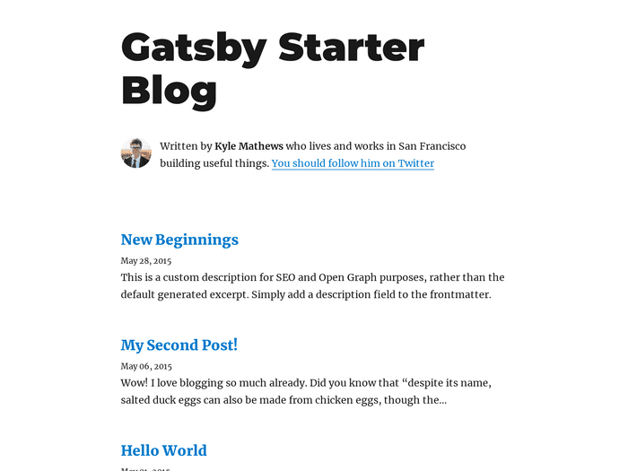

## Gatsby

블로그를 직접 만들어 보고 싶어 [Gatsby](https://www.gatsbyjs.com/)를 선택했다. React 기반의 대표적인 Static Site Generator로 다양한 플러그인을 제공하고 커뮤니티가 풍부하다. 덕분에 빠르게 커스터마이징해 블로그를 만들 수 있었다.

### gatsby-starter-blog

Gatsby에서는 다양한 스타터를 제공하는데 최대한 가볍게 시작하기 위해 공식 블로그 스타터인 [gatsby-starter-blog](https://www.gatsbyjs.com/starters/gatsbyjs/gatsby-starter-blog)를 선택했다.



### Netlify

[Netlify](https://www.netlify.com/)는 정적 사이트를 호스팅해주는 서비스로 프론트엔드 스택으로만 구성된 사이트가 필요한 많은 사람들이 이용하는 것 같다. 사용법이 정말 간단한데 몇 번의 클릭만으로 사이트를 배포할 수 있다. 이 블로그의 경우 Github 계정과 연동하여 push할 때마다 자동으로 빌드 및 배포되도록 했다.

## Customizing

커스터마이징은 최소화하고 우선 글 쓰는 데 집중하고자 했다. 블로그에 글이 좀 쌓이면 차차 다른 기능을 추가해보려 한다.

### 한글 폰트

[gatsby-plugin-webfonts](https://www.gatsbyjs.com/plugins/gatsby-plugin-webfonts/) 플러그인을 사용해 구글 폰트를 적용했다. 기본 폰트는 Noto Sans KR, 소스 코드 폰트는 Fira Code를 사용했다.

```js
// gatsby-config.js

{
  resolve: `gatsby-plugin-webfonts`,
  options: {
    fonts: {
      google: [
        {
          family: "Noto Serif KR",
          variants: ["400", "700"],
        },
        {
          family: "Noto Sans KR",
          variants: ["400", "700"],
        },
        {
          family: "Fira Code",
          variants: ["400"],
        },
      ],
    },
  },
}
```

### Code Hightlight

[prism-themes](https://github.com/PrismJS/prism-themes) 테마 중 prism-material-dark 테마를 적용했다.

```js
// gatsby-browser.js

// Highlighting for code blocks
import "prism-themes/themes/prism-material-dark.css"
```

### 태그

### 검색: Flex Search

## Lighthouse

### Accessibility

### PWA

## Netlify CMS
